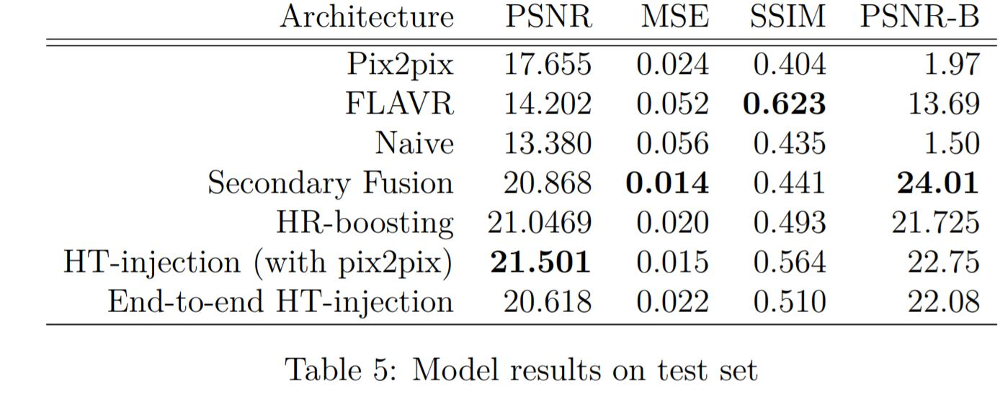
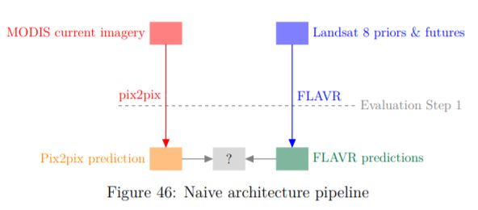
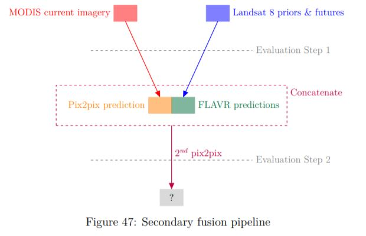
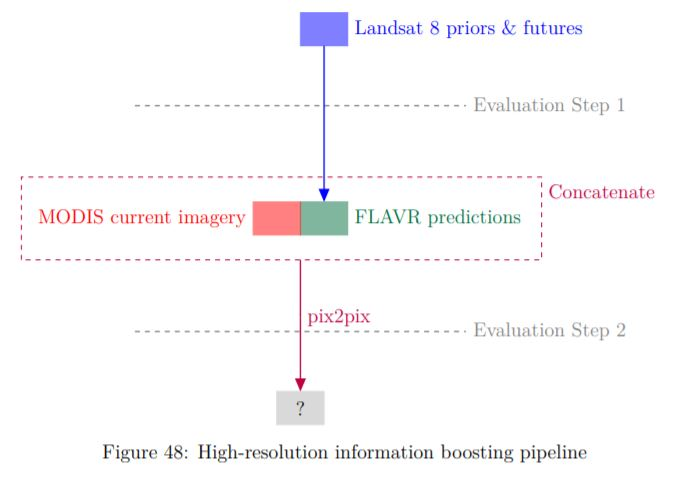
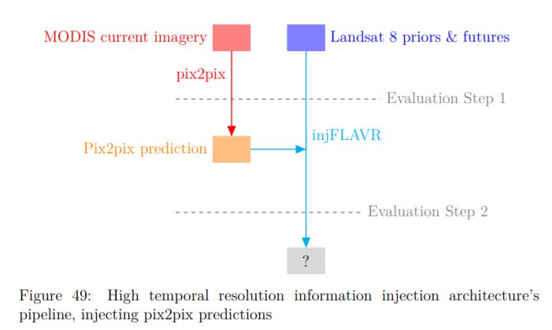
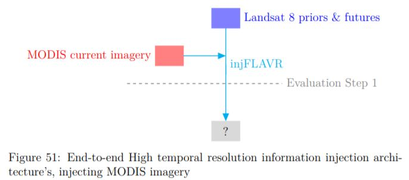
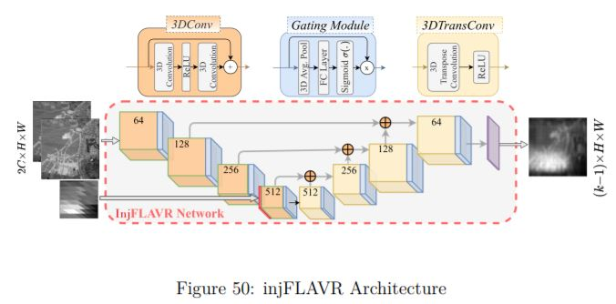

# HSHT-Satellite-Imagery-Synthesis
By: [Yuval Epstain Ofek](https://github.com/yuvalofek)

Code used for my thesis: **"Improving Flood Maps by Increasing the Temporal Resolution of Satellites Using Hybrid Sensor Fusion - Video Interpolation Networks"**

### The work is heavily based on: 
* Pix2pix from: https://github.com/junyanz/pytorch-CycleGAN-and-pix2pix
* FLAVR from: https://github.com/tarun005/FLAVR

### Results

## Contents
1. [Introduction](#introduction)
1. [Models](#models)

## Introduction
Floods account for a ½ of the world’s weather related disasters, annually force 26 Million people into poverty, cause $7.5 billion in damages (in the US alone), while simultaneously leading to economic, urban, and commercial setbacks around the globe. While we can't always stop floods, we can plan ahead so that we can mitigate losses, respond quickly, and recover flooded areas more efficiently. 

One of the most useful tools for doing these is a flood map, which describe the extent a flood has affected an area. Flood maps have been historically difficult to generate, though recent decisions to make use of satellite imagery have slowly made these maps more accessable and easier to produce. Choosing to use satellite imagery to generate flood maps comes with its own drawbacks, namely that satellites have a roughly fixed spatio-temporal resolution. That means that satellites that come back to an area more frequently tend to have lower imaging resolution compared to satellites that visit the come back at a lower frequency. This is a problem for floods as floods are high frequency events - if a satellite does not visit a region frequently enough it may completely miss out on an entire flood (figure 1). Looking at this at a different way, for a given flood duration there is a limited spatial-resolution image we can obtain from a sattelite, which may or may not be sufficient to generate a sufficiently accurate flood map. 

  

This work aims to resolve this issue by combining two deep learning methodologies: sensor fusion and temporal interpolation. Sensor fusion will allow our models to capture high time frequency events from lower spatial resolution sensors while temporal interpolation will allow us to retain high spatial resolution outputs from high spatial resolution sensors. 

  

### Models:
We propose the combination of video frame interpolation on a single satellite and cross satellite sensor fusion via image-to-image translation as a means of creating higher spatial higher temporal imagery. 

To do this, we first modified FLAVR and Pix2pix to handle satellite imagery. We then downloaded a custom dataset of MODIS and Landast 8 using [gee_downloader](https://github.com/yuvalofek/GEE_Downloader) to use as our data. 

We combined the two networks in a variety of ways as shown in in the following diagrams: 
### 1. Naive - averaging the outputs of the image translation and video interpolation models.

  

### 2. Secondary sensor-fusion - use the outputs of the image interpolation and satellite sensor fusion networks as inputs to a secondary sensor fusion network.

  

### 3. High-resolution information boosting - feeding the output of the video interpolation to the image translation model to boost its understanding of the high-resolution space.

  

### 4. High-temporal information injection - injecting low-resolution high temporal information to the video interpolation model.

  

  

The model used to inject the low resolution images is dubbed injFLAVR and can be seen in the following diagram:

  

